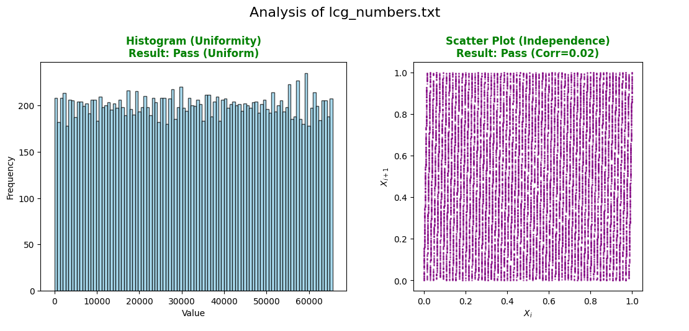
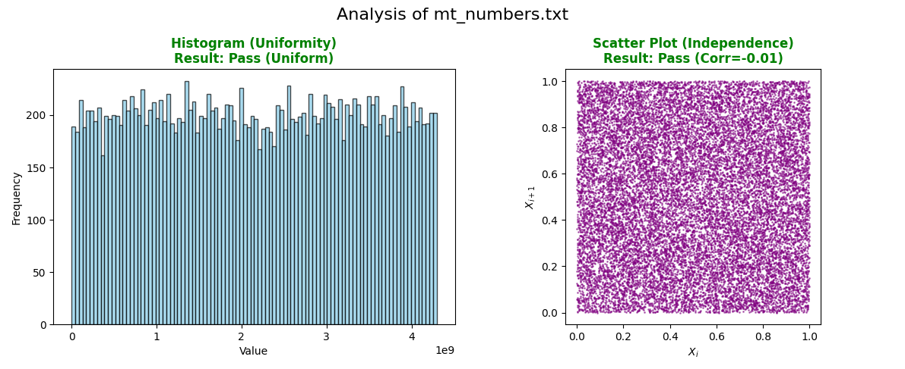
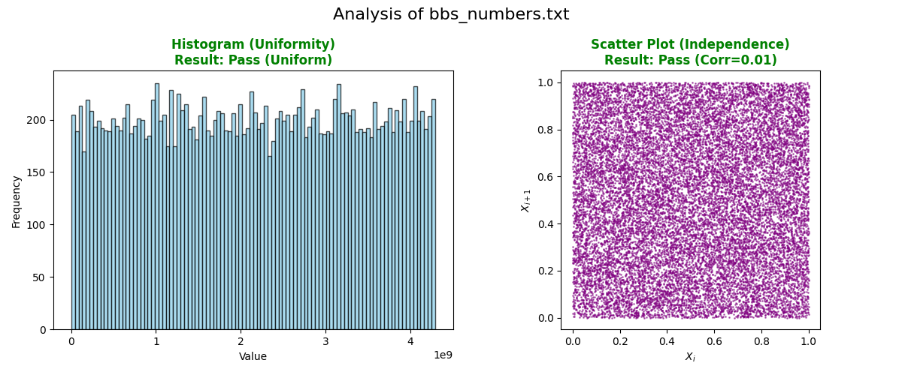

# Report for CS 215 Discrete Math 2025 Fall Semester Project
#### by 成轩宇 12412908  

## 简介  
本项目选择伪随机数生成器（Pseudorandom Number Generator, PRNG）作为研究对象。主要研究伪随机数生成器的实现原理以及应用，尤其是在密码学中。

项目已同步至 GitHub，地址为：https://github.com/hhhhcxy/discrete_math_project。  
所有代码可在仓库中找到。

## 一，伪随机数生成器概述  
计算机科学中的许多应用都需要随机数。从简单的算法设计，如快速排序中的随机化选择，到复杂的密码学协议，如 RSA 加密中密钥的生成，都需要随机数。  

伪随机数生成器（Pseudorandom Number Generator, PRNG）是通常用来生成这种**不确定的数**的算法，但与真随机数生成器（True Random Number Generator, TRNG）不同。区分不同随机数生成器的关键在于**不确定性**。

根据生成结果的不确定性，伪随机数生成器可以分为三种级别：

1. **伪随机数**（Pseudorandom Numbers）：通过确定性算法生成，虽然看起来随机，但实际上是可预测的。
2. **密码学安全的伪随机数**（Cryptographically Secure Pseudorandom Numbers）：虽然是伪随机数，但设计上难以预测，适用于密码学应用。
3. **真随机数**（True Random Numbers）：完全不可预测，通常依赖于物理现象，如放射性衰变。  

伪随机数在计算机科学中有广泛应用。包括模拟、密码学、游戏开发等领域。由于真随机数**依赖于计算机外部的物理现象**，获取成本较高且速度较慢，且多数应用场景并不需要真随机数，因此伪随机数生成器被广泛使用。例如随机化算法中的随机选择只需要最简单的伪随机数生成器即可满足需求，而密码学中，为了确保安全性，则需要使用密码学安全的伪随机数生成器。

## 二，伪随机数生成器的评估  

不同的伪随机数生成器在质量上有显著差异。为了区分不同生成器的优劣，必须对其生成的伪随机数序列进行评估。  
评估伪随机数生成器的质量主要从以下几个方面考虑：

### 随机性（均匀分布，独立性）
这是评估伪随机数生成器最基本的标准。理想的伪随机数生成器应生成均匀分布且相互独立的数值序列。

* 均匀分布：卡方拟合度检验（Chi-Squared Goodness of Fit Test）  
  - 假设区间被等分为 $k$ 个箱（bins），样本量为 $n$，期望频数 $E_i = \frac{n}{k}$。  
  - 统计量：  
    $$
    \chi^2 = \sum_{i=1}^{k} \frac{(O_i - E_i)^2}{E_i}
    $$
    其中 $O_i$ 为第 $i$ 箱的观察频数。  
  - 自由度为 $k-1$，计算 p-value 并与显著性水平（常取 $\alpha = 0.05$）比较。若 p-value < $\alpha$，拒绝“均匀分布”假设；否则认为“无法拒绝”（视为通过均匀性检验）。

* 独立性：散点图与自相关性分析（Scatter Plots and Autocorrelation）  
  - 构造相邻点对 $(x_i, x_{i+1})$，观察散点图是否出现条纹/结构。  
  - 滞后 1 的自相关系数（样本相关系数）：  
    $$
    r_1 = \frac{\operatorname{cov}(X_i, X_{i+1})}{\sigma_{X_i}\,\sigma_{X_{i+1}}}
    $$
    其中 $\operatorname{cov}$ 为协方差，$\sigma$ 为样本标准差。$\lvert r_1 \rvert$ 越接近 0，线性相关越弱；可结合样本规模设置阈值（如 0.05）进行经验判断。

借助 AI 辅助编写了一个简单的伪随机数生成器评估工具 `prng_evaluator.py`，实现了上述两种随机性检验方法：
> 代码位于（`prng_evaluator/prng_evaluator.py`）  
> - `test_uniformity`：使用 `np.histogram` 生成 $O_i$，计算期望频数 $E_i = n/k$，调用 `stats.chisquare` 得到 $\chi^2$ 与 p-value，并输出判定结果。  
> - `test_independence`：以归一化数据构造 $(x_i, x_{i+1})$，用 `np.corrcoef` 计算 $r_1$，并以阈值（默认 0.05）给出通过/不通过提示。  

### 不可预测性  
不可预测性是伪随机数生成器（PRNG）与密码学安全伪随机数生成器（CSPRNG）的界限。即便一个序列通过了上述的随机性检验（均匀且独立），如果攻击者能够根据已知的历史序列计算出下一个数值，该生成器在密码学上就是不安全的。

*   **下一比特测试（Next-bit Test）：**  
    一个PRNG被称为“不可预测的”，是指对于任何**多项式时间** 算法，给定序列的前 $k$ 个比特，预测第 $k+1$ 个比特的成功概率与 $1/2$ 的差异是**可忽略的**。
    即：没有算法能比“抛硬币瞎猜”更准确地预测下一个数。
    $$ P(\text{predict } x_{i+1} | x_1, \dots, x_i) \approx \frac{1}{2} $$

*   **前向与后向安全性（Forward & Backward Secrecy）：**  
    *   **前向安全性**：即使攻击者获取了当前的内部状态，也无法推断出**之前**生成的随机数。
    *   **后向安全性**：即使攻击者获取了当前的内部状态，只要系统随后引入了新的熵，攻击者也无法预测**未来**的随机数。

### 不可重现性
从严格的算法定义上讲，伪随机数生成器是**确定性** 的算法。只要输入**相同的种子**，它必然生成完全相同的序列。因此，伪随机数生成器本质上是可重现的。满足不可重现性的伪随机数生成器，必须依赖于**外部的不可预测熵源**，这样才能确保每次生成的序列不同。对于密码学安全的伪随机数生成器（CSPRNG），通常会结合系统熵池来实现不可重现性。

## 三, 常见的伪随机数生成器算法  

选取了三种最具代表性的算法进行深入研究：线性同余生成器（代表基础历史算法）、梅森旋转算法（代表现代工业标准）、Blum-Blum-Shub 算法（代表密码学安全算法）。

### 线性同余生成器（Linear Congruential Generator, LCG）  

LCG 是最基本且最著名的伪随机数生成算法之一。它利用线性方程在模运算下来生成序列。
#### 数学原理
递推公式如下：
$$ X_{n+1} = (aX_n + c) \pmod m $$
其中：
*   $m$：模数，$m > 0$。
*   $a$：乘数，$0 < a < m$。
*   $c$：增量，$0 \le c < m$。
*   $X_0$：种子 (Seed)，$0 \le X_0 < m$。

**Hull-Dobell 定理**  
LCG 的最大周期为 $m$。根据该定理，LCG 具有最大周期 $m$ 的充要条件是：  
1.    $c$ 与 $m$ 互素 ($\gcd(c, m) = 1$)。
2.    $m$ 的所有素因子 $p$ 都能整除 $a-1$。
3.    如果 $m$ 是 4 的倍数，则 $a-1$ 也是 4 的倍数。

实际使用时，要注意参数的选择是否满足上述条件，以确保生成器具有良好的周期性和随机性。

#### 算法特色与优劣
*   **优点**：算法简单，计算速度较快，内存占用极小。
*   **缺点**：
    *   **晶格结构（Lattice Structure）**：若绘制 $(X_n, X_{n+1})$ 散点图，就会观察到散点落在几条平行的直线上，具有极强的相关性。这被称为 Marsaglia 效应。
*   **适用场景**：对随机性要求不高的简单模拟。

#### 示例
```python
class LCG:
    def __init__(self, seed: int, a: int , c: int , m: int ):
        self.state = seed % m
        self.a = a
        self.c = c
        self.m = m

    def next(self) -> int:
        self.state = (self.a * self.state + self.c) % self.m
        return self.state

    def generate(self, n: int) -> Iterator[int]:
        for _ in range(n):
            yield self.next()
```
通过选取参数 $m = 2^{16}$、$a = 65$、$c = 1$，可以观察到明显的晶格结构。
<center>
    
</center>

### 梅森旋转算法（Mersenne Twister）

梅森旋转算法（Mersenne Twister, MT）是由松本眞和西村拓士在 1997 年提出的高阶线性反馈移位寄存器（LFSR）算法。
#### 数学原理。
梅森旋转算法基于以下几个关键概念：
*   **状态向量**：包含 624 个 32 位字，总共 19968 位，作为算法的内部状态。
*   **梅森素数**：周期长度为 $2^{19937} - 1$，是一个梅森素数。
*   **线性变换**：通过矩阵运算和位操作来更新状态向量。

**核心步骤：**
1. **初始化**，使用种子初始化状态向量。
2. **扭转变换（Twist）**，通过线性变换更新状态向量。
3. **卷绕变换（Tempering）**，对输出进行非线性变换以提高随机性。

#### 算法特色与优劣
*   **优点**：
    *   **极长周期**：$2^{19937} - 1$，远远超过应用需求。
    *   **计算速度快**：仅需位操作和简单的算术运算。
    *   **广泛采用**：Python、Ruby、R 等语言的默认伪随机数生成器。
*   **缺点**：
    *   **空间占用大**：需要 624 个 32 位字的内存（2.5 KB），相比 LCG 的占用大。
    *   **非密码学安全**：已知状态后可以完全恢复内部状态，不适用于密码学。

#### 示例
```python
class MersenneTwister:
    def __init__(self, seed: int):
        self.n = 624
        self.m = 397
        self.matrix_a = 0x9908b0df
        self.upper_mask = 0x80000000
        self.lower_mask = 0x7fffffff
        self.mt = [0] * self.n
        self.mti = self.n + 1
        
        self.mt[0] = seed & 0xffffffff
        for i in range(1, self.n):
            s = 1812433253 * (self.mt[i-1] ^ (self.mt[i-1] >> 30)) + i
            self.mt[i] = s & 0xffffffff

    def _twist(self):
        for i in range(self.n - self.m):
            y = (self.mt[i] & self.upper_mask) | (self.mt[i+1] & self.lower_mask)
            self.mt[i] = self.mt[i+self.m] ^ (y >> 1) ^ (self.matrix_a if y & 1 else 0)
        for i in range(self.n - self.m, self.n - 1):
            y = (self.mt[i] & self.upper_mask) | (self.mt[i+1] & self.lower_mask)
            self.mt[i] = self.mt[i - self.n + self.m] ^ (y >> 1) ^ (self.matrix_a if y & 1 else 0)
        y = (self.mt[self.n-1] & self.upper_mask) | (self.mt[0] & self.lower_mask)
        self.mt[self.n-1] = self.mt[self.m-1] ^ (y >> 1) ^ (self.matrix_a if y & 1 else 0)
        self.mti = 0

    def next(self) -> int:
        if self.mti >= self.n:
            self._twist()
        y = self.mt[self.mti]
        y ^= y >> 11
        y ^= (y << 7) & 0x9d2c5680
        y ^= (y << 15) & 0xefc60000
        y ^= y >> 18
        self.mti += 1
        return y & 0xffffffff
```
梅森旋转算法在散点图中表现出**无明显晶格结构**，自相关系数接近 0，均匀分布性显著优于 LCG。
<center>
    
</center>

### Blum-Blum-Shub (BBS) 算法

#### 简介与原理概述
Blum-Blum-Shub（BBS）是经典的密码学安全伪随机数生成器（CSPRNG）。核心思想：
- 选取两个满足 p ≡ 3 (mod 4)、q ≡ 3 (mod 4) 的大素数，令 n = p · q（Blum 整数）。
- 选择与 n 互素的种子 x0，递推 x_{i+1} = x_i^2 mod n。
- 通常输出 x_i 的最低有效位（LSB），或累积若干位拼接为 32 位整数。

尽管算法简单，但其安全性建立在著名的困难问题上。

#### 密码学优势
- **不可预测性**：BBS 的安全性基于**整数分解难题**和**二次剩余假设**。
  - **整数分解难题**：给定一个大整数 n，找到其非平凡因数在多项式时间内被认为是困难的。与 RSA 加密的安全性基础相同。
  - **二次剩余假设（Quadratic Residuosity Assumption, QRA）**：给定一个模 n 的数 y（n 为大 Blum 整数，且未知其因数分解），判断 y 是否是二次剩余（存在 x 使 x² ≡ y mod n）在多项式时间内被认为是困难的。  

 **为何难以预测下一比特**：BBS 的状态更新 $x_{i+1} = x_i^2 \mod n$，本质上将状态隐藏为 n 下的二次剩余。经过标准安全性证明，预测 BBS 的下一比特可被归约为解决二次剩余判定问题，而该问题被认为至少与整数分解同样困难。

#### 算法特色与优劣
* **优点**：
    - 高安全性：基于整数分解难题和二次剩余假设，适用于密码学应用。  

* **缺点**：
    - 速度较慢：每位都需要一次模平方运算，生成 32 位整数需多次迭代。
    - 参数生成成本高：需要安全素数与安全种子。在实际密码学应用中必须使用大素数。

#### 示例
```python
class BBS:
    def __init__(self, p: int, q: int, seed: int):
        assert p % 4 == 3 and q % 4 == 3, "p,q 必须满足 ≡ 3 (mod 4)"
        self.n = p * q
        self.x = seed % self.n
        # 若不互素则调整种子
        import math
        if math.gcd(self.x, self.n) != 1:
            self.x = (self.x + 1) % self.n

    def next_bit(self) -> int:
        self.x = pow(self.x, 2, self.n)
        return self.x & 1

    def next_word(self, k: int = 32) -> int:
        v = 0
        for i in range(k):
            v |= (self.next_bit() << i)
        return v

    def generate_words(self, n: int, k: int = 32):
        for _ in range(n):
            yield self.next_word(k)
```

BBS 的生成结果满足均匀分布与独立性要求，且无明显晶格结构。
<center>
    
</center>

## 四，不同编程语言提供的伪随机数生成器 
### Python
Python 标准库中的 `random` 模块默认使用的是 **梅森旋转算法 (Mersenne Twister, MT19937)**。也提供了 `secrets` 模块，用于生成密码学安全的随机数。

### C++
C++ 最简单的 `rand()` 函数在多数实现中是基于 **线性同余生成器 (LCG)** 实现的，质量较差（例如模数较小，$32767$，生成较大范围随机数时甚至需要手动组合多次调用）。
C++11 引入了 `<random>` 库，提供了多种包括 MT19937 在内的高质量伪随机数生成器。

### Java 
Java 的标准类 `java.util.Random` 使用的是 **线性同余生成器 (LCG)**。它使用的公式为 $X_{n+1} = (X_n \times 25214903917 + 11) \pmod{2^{48}}$，输出结果时会取高 32 位作为随机数。
但是，Java 也提供了 `java.security.SecureRandom` 等其他常用伪随机数生成器。 如`java.security.SecureRandom` 属于密码学安全的生成器。

## 五，公钥密码学标准（Public-Key Cryptography Standards, PKCS）

PKCS（由 RSA Laboratories 提出的一系列标准）在多处要求强随机性。核心原则：凡是需要不可预测的值都必须使用密码学安全伪随机数生成器（CSPRNG），禁止使用一般 PRNG（如 LCG/MT）替代。

- PKCS#1： 规定 RSA 加密与签名的标准
  - RSA-OAEP：加密时引入随机“seed”，seed 必须不可预测以确保安全。
  - RSA-PSS：签名时使用随机 salt 增强不可伪造性；salt 必须随机、不可重复、不可预测。
  - 要求：seed/salt 必须由 CSPRNG 产生，长度与哈希函数安全参数一致。

- PKCS#5：对 salt 的使用进行规范
  - 使用随机盐（salt）与迭代计数从口令派生密钥；盐必须唯一且不可预测，防止预计算/彩虹表攻击。
  - 要求：盐长度不低于 64 bit，必须由 CSPRNG 产生。

- PKCS#11：对 Cryptoki API 进行规范
  - 明确定义随机数接口：C_GenerateRandom / C_SeedRandom 等。
  - 要求随机数生成器必须满足 CSPRNG 标准，确保生成的随机数不可预测。

PKCS 标准通过严格要求使用 CSPRNG，确保了公钥密码学操作的安全性，防止因随机数质量不足而导致的潜在攻击。通过执行这些标准，以保障加密系统的整体安全性。

## 六，总结  
伪随机数生成器在计算机科学中是重要的基础工具。从最简单的线性同余生成器，到密码学安全的 Blum-Blum-Shub 算法，不同的生成器适用于不同的应用场景。对于不同的需求，应选择合适的伪随机数生成器。若对安全性无要求，则简单的生成器拥有更快的速度和更低的资源消耗。但若涉及密码学应用，则必须使用密码学安全的生成器，遵循 PKCS 等标准，确保系统的整体安全性，切勿因随机数质量不足而引入漏洞。

---

### 参考文献
*   Wikipedia contributors. (n.d.). *Pseudorandom number generator*. Wikipedia, The Free Encyclopedia. Retrieved January 11, 2026, from https://en.wikipedia.org/wiki/Pseudorandom_number_generator
*   CTF Wiki contributors. (n.d.). *Introduction - PRNG*. CTF Wiki. Retrieved January 11, 2026, from https://ctf-wiki.org/crypto/streamcipher/prng/intro/
*   Wikipedia contributors. (n.d.). *PKCS*. Wikipedia, The Free Encyclopedia. Retrieved January 11, 2026, from https://en.wikipedia.org/wiki/PKCS

